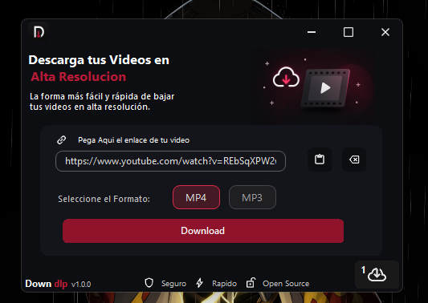
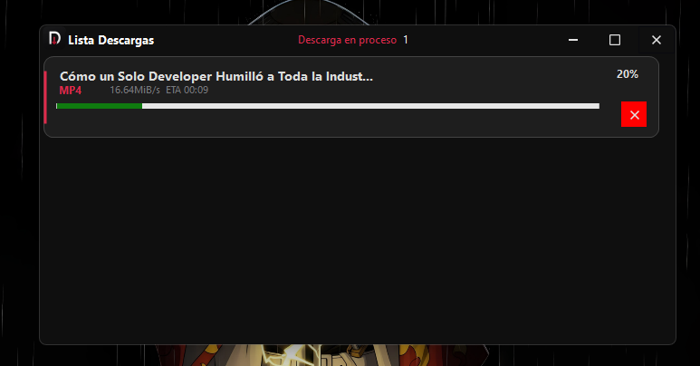

# 🚀 Downdlp

  <b>La potencia de yt-dlp, ahora con la simplicidad de un solo clic.</b>

  Aplicación de escritorio para descargar contenido multimedia desde múltiples plataformas, 
  con una interfaz moderna, rápida y sin complicaciones.

---

## ✨ Características

- ⚡ Descarga rápida y eficiente  
- 🖱️ Descarga en un solo clic  
- 🎯 Interfaz moderna y minimalista  
- 🔗 Compatible con múltiples plataformas  
- 🧩 Sin uso de comandos  
- ⏹️ Cancelación de descargas en tiempo real  
- 📁 Organización automática en la carpeta de Descargas  
- 🚫 Prevención de descargas duplicadas  
- 📊 Gestión eficiente de procesos  
---

## 📸 Capturas de pantalla

<table align="center">
  <tr>
    <td align="center">
       
      🖥️ Interfaz principal
    </td>
    <td align="center">
       
      ⬇️ Proceso de descarga
    </td>
  </tr>
  <tr>
    <td align="center" colspan="2">
       
      ⚡ Descarga en un solo clic
    </td>
  </tr>
</table>

---

## 📌 Descripción

**Downdlp** es una aplicación de escritorio diseñada para ofrecer una experiencia de descarga **rápida, directa y sin complicaciones**.

Integra la potencia de `yt-dlp`, una de las herramientas más robustas para la descarga de contenido multimedia, pero adaptada a una interfaz gráfica amigable que elimina la necesidad de configuraciones técnicas o uso de comandos.

Simplemente pega el enlace, haz clic… y listo.

---

## 🌐 Plataformas compatibles

-  **YouTube**  
-  **Facebook**  
-  **Instagram**  
-  **TikTok**  
-  **Pinterest**  
- Y muchas más compatibles con `yt-dlp`

---

## 📦 Instalación

**Downdlp** no requiere instalación tradicional.

1. Descarga la última versión desde GitHub  
    **[⬇️ Descargar Downdlp](../../releases/latest)**  

2. Ejecuta el archivo `.exe`  

---

> ⚠️ **Nota de seguridad**
>
> Es posible que Windows muestre una advertencia de **SmartScreen** al ejecutar la aplicación,
> ya que no cuenta con firma digital.
>
> Para continuar:
> - Haz clic en **"Más información"**
> - Luego en **"Ejecutar de todas formas"**

---

## 🚀 Uso

1. Abre la aplicación  
2. Pega el enlace del video  
3. Haz clic en **Descargar**  
4. Espera a que finalice el proceso  
5. Accede al archivo desde tu carpeta de descargas  

---

## 🛠️ Tecnologías utilizadas

-  **C# / .NET**  
  Base del desarrollo y lógica principal de la aplicación.

- 🪟 **WinForms (.NET)**  
  Interfaz gráfica enfocada en simplicidad y usabilidad.

- ⚙️ **yt-dlp**  
  Motor principal de descarga multimedia.  
  🔗 https://github.com/yt-dlp/yt-dlp  

- 🎞️ **FFmpeg**  
  Procesamiento y conversión de audio y video.  
  🔗 https://ffmpeg.org/
  
---
  ## 💻 Compatibilidad

| Sistema Operativo | Soporte |
|------------------|--------|
| 🪟 Windows       | ✅ Compatible |
| 🐧 Linux         | ❌ No soportado |
| 🍎 macOS         | ❌ No soportado |
---
> 💡 Soporte para otras plataformas podría considerarse en futuras versiones.
